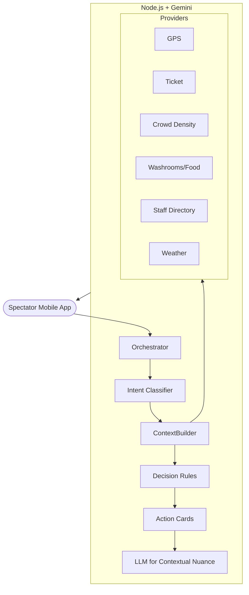

# Stadium Command Center 🏟️

**Google Maps for Stadiums, powered by Gemini.**

Stadium Command Center is an intelligent, context-aware mobile companion designed to solve the chaos of large-scale live events. It replaces passive chat interfaces with a proactive **Decision Engine** that guides spectators with live GPS, realtime crowd and queue monitoring, and immediate emergency routing.

## 🏆 Problem Statement
A judge evaluating a stadium app has 30 to 90 seconds to decide if it's viable. Current stadium apps force users to dig through menus, or rely on AI chatbots that require users to type long queries in noisy, crowded environments. When a user asks "Where is my seat?", they don't want a paragraph of text—they want a blue line on a map showing them exactly where to walk.

## 💡 Solution
We built a **Mobile-First Stadium Companion** that shifts the paradigm from "Chatbot" to "Proactive Navigator". 
- **Context Engine:** Automatically pulls your VIP ticket, live GPS, crowd density, and queue lengths.
- **Decision Engine:** Evaluates context to trigger intelligent actions (e.g., suggesting Washroom C6 instead of C4 because of a 15-minute queue).
- **Live Navigation:** A full-screen, Google Maps-style navigation experience with a blue polyline, turn-by-turn guidance, and ETA tracking.

## 🏗️ Architecture



## ✨ Key Features
1. **Live Turn-by-Turn Navigation:** OSRM-powered walking routes with Google Maps-style HUDs.
2. **Proactive Interruptions:** If a gate becomes congested while you walk, the app slides in a high-priority push notification to reroute you instantly.
3. **Queue Intelligence:** Recommends alternative facilities not just by distance, but by real-time queue lengths and occupancy.
4. **Interactive Action Cards:** Instead of copying text, users tap buttons to Call Medical, Navigate to Seat, or Share Ticket.
5. **Beautiful Mobile UX:** 48px touch targets, premium Apple-style blurs, soft shadows, and fluid micro-animations.

## 🛠️ Tech Stack
- **Frontend:** Next.js 14, React, Tailwind CSS, Leaflet (OSRM Routing), Lucide Icons
- **Backend:** Node.js, Express, Google Gemini SDK (gemini-2.5-flash)
- **Tooling:** TypeScript, ESLint

## 🚀 Setup & Run
1. Clone the repository.
2. Navigate to `backend/`:
   ```bash
   npm install
   # Add your GEMINI_API_KEY to .env
   npm run dev
   ```
3. Navigate to `frontend/`:
   ```bash
   npm install
   npm run dev
   ```
4. Open `http://localhost:3000`. Switch your browser DevTools to Mobile View (e.g., iPhone 14 Pro) for the intended experience.

## 📱 Demo Flow
1. **The Greeting:** Open the app. The AI immediately welcomes you, knows you have a Coldplay ticket, and tells you Gate 6 is the fastest entrance.
2. **The Navigation:** Tap "Navigate to my Seat". A live map opens with a blue polyline. 
3. **The Proactive Reroute:** After 15 seconds, a massive crowd is simulated at Gate 6. A red toast notification pops up. Tap "Switch Route" to dynamically adjust.
4. **The Intelligence:** Go back, tap "Find Washroom". Notice it explicitly suggests Washroom C6 because C4 has a 15-minute wait.
5. **The Utilities:** Explore the highly realistic Tickets and Profile tabs.

## 🔮 Future Scope
- Integration with live stadium IoT sensors for millimeter-accurate indoor positioning (Bluetooth Beacons).
- Direct digital wallet integration for purchasing food from the seat.
- AR overlay for finding friends in the crowd.
