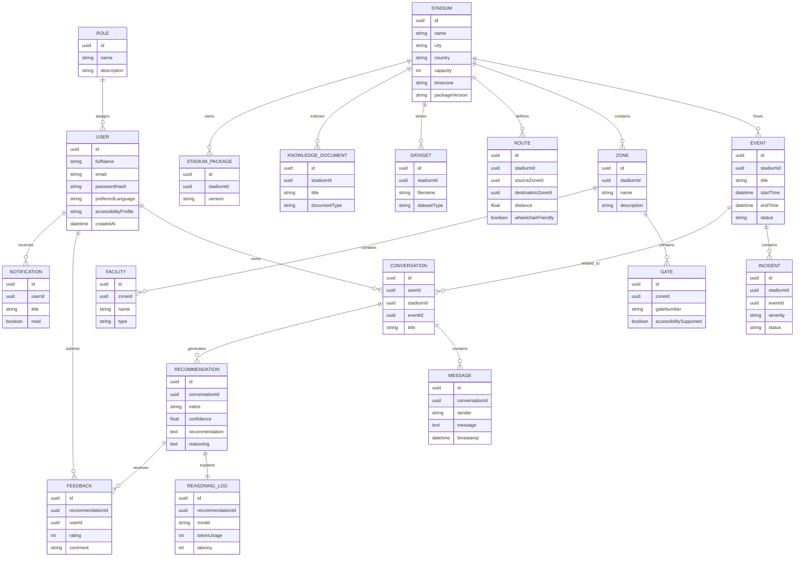

# Entity Relationship Diagram (ERD)

Version: 1.0

Status: Frozen

---

# Purpose

This document defines the logical Entity Relationship Diagram (ERD) for the Stadium Command Center platform.

The design follows a normalized relational model while supporting future AI capabilities, multi-stadium deployments, Retrieval-Augmented Generation (RAG), explainability, and operational analytics.

GitHub natively renders Mermaid diagrams, making this document useful for developers, reviewers, and evaluators.

---

# Mermaid ER Diagram

---

# Relationship Summary

## User Domain

A **Role** can be assigned to many **Users**.

A **User** can create multiple **Conversations**.

A **Conversation** contains multiple **Messages**.

Each **Conversation** may generate multiple AI **Recommendations**.

Every **Recommendation** is linked to exactly one **Reasoning Log**.

Users may submit feedback for AI recommendations.

Users receive platform notifications.

---

# Stadium Domain

A **Stadium** hosts multiple **Events**.

A **Stadium** contains multiple:

- Zones
- Routes
- Knowledge Documents
- Datasets
- Stadium Packages

Each **Zone** contains:

- Gates
- Facilities

---

# AI Domain

Each conversation can generate multiple recommendations.

Every recommendation stores:

- Generated response
- Confidence score
- Explainability
- Intent

Each recommendation is fully traceable through a dedicated Reasoning Log.

---

# Operational Domain

Each Event may contain multiple operational Incidents.

Incidents can later be connected with:

- AI Recommendations
- Volunteer actions
- Analytics
- Future Crowd Prediction modules

---

# Future Expansion

The current ERD intentionally leaves room for future entities without requiring structural redesign.

Planned entities include:

- CrowdSnapshot
- IndoorMap
- NavigationGraph
- IoTDevice
- Camera
- Sensor
- Weather
- DigitalTwin
- Prediction
- VoiceSession
- ARNavigation
- EmergencyWorkflow

---

# Design Principles

The ERD follows these principles:

- Third Normal Form (3NF)
- UUID primary keys
- Soft delete support
- Referential integrity
- Domain-driven grouping
- Explainable AI traceability
- Multi-stadium support
- Multi-event support
- AI-first architecture
- Future extensibility

---

# Summary

The Stadium Command Center database is organized into five major domains:

- Identity & Access
- Stadium Operations
- Artificial Intelligence
- Knowledge Management
- Operational Analytics

This separation minimizes coupling, improves maintainability, enables independent module development, and provides a strong foundation for scalable AI-powered stadium operations.